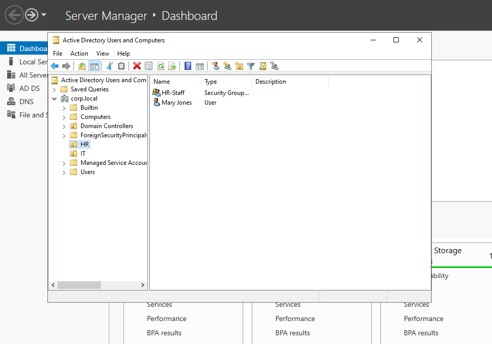
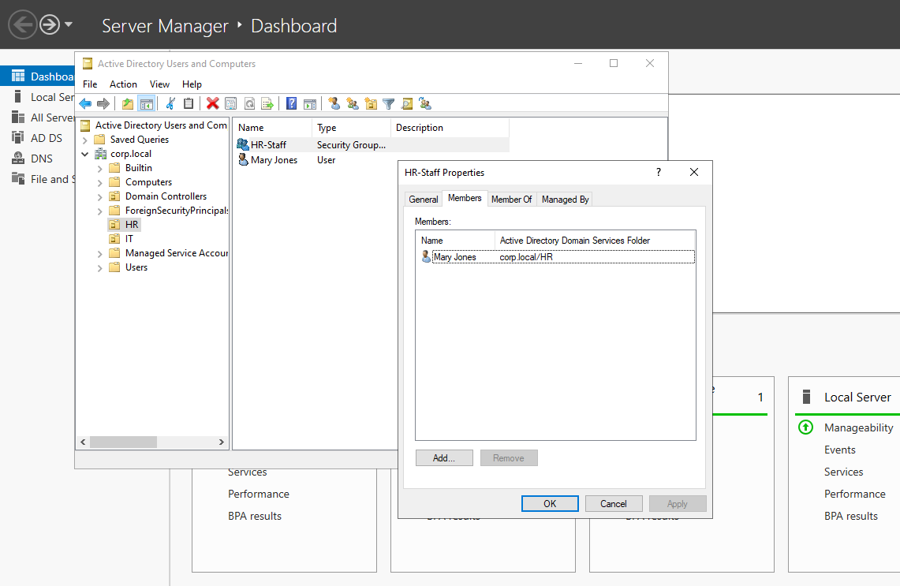

# Active Directory Domain Installation and Configuration

This lab configures a Windows Server as an Active Directory Domain Controller (DC) using PowerShell exclusively. It includes AD DS role installation, domain promotion, creation of OUs, users, and groups, and verification of functionality.

## 0. Connect to the Windows Server via RDP
Enable Remote Desktop for remote access:

Check status:
```
Get-ItemProperty -Path "HKLM:\System\CurrentControlSet\Control\Terminal Server" -Name "fDenyTSConnections"
```
Value 1: Disabled; 0: Enabled.

Enable RDP:
```
Set-ItemProperty -Path "HKLM:\System\CurrentControlSet\Control\Terminal Server" -Name "fDenyTSConnections" -Value 0
```

Enable firewall rule:
```
Enable-NetFirewallRule -DisplayGroup "Remote Desktop"
```

Verify rule:
```
Get-NetFirewallRule -DisplayGroup "Remote Desktop"
```

Connect from client:
```
mstsc /v:192.168.0.121
```
Replace with server IP; authenticate as administrator.

## 1. Configure Static IP and DNS
Set static IP and self-referential DNS:

List adapters:
```
Get-NetAdapter
```

Assign IP:
```
New-NetIPAddress -InterfaceAlias "Ethernet" -IPAddress 192.168.0.121 -PrefixLength 24 -DefaultGateway 192.168.1.1
```

Set DNS:
```
Set-DnsClientServerAddress -InterfaceAlias "Ethernet" -ServerAddresses 192.168.0.121
```

Verify:
```
Get-NetIPAddress -InterfaceAlias "Ethernet"
Get-DnsClientServerAddress -InterfaceAlias "Ethernet"
Test-Connection 8.8.8.8
```

## 2. Install the Active Directory Domain Services (AD DS) Role
Install role:
```
Install-WindowsFeature -Name AD-Domain-Services -IncludeManagementTools
```

Verify:
```
Get-WindowsFeature -Name AD-Domain-Services
Get-WindowsFeature | Where-Object {$_.Name -like "*AD*"}
Import-Module ADDSDeployment
Get-Service -Name ntds
```
Expected: Installed (True); module loaded; service stopped pre-promotion.

## 3. Promote the Server to a Domain Controller
Load module:
```
Import-Module ADDSDeployment
```

Promote to forest:
```
Install-ADDSForest `
-DomainName "corp.local" `
-DomainNetbiosName "CORP" `
-InstallDns `
-CreateDnsDelegation:$false `
-SafeModeAdministratorPassword (ConvertTo-SecureString "P@ssw0rd!" -AsPlainText -Force) `
-Force
```
Server restarts post-execution.

## 4. Create Organizational Units (OUs), Groups, and Users
Load AD module:
```
Import-Module ActiveDirectory
```

Create OUs:
```
New-ADOrganizationalUnit -Name "IT" -Path "DC=corp,DC=local"
New-ADOrganizationalUnit -Name "HR" -Path "DC=corp,DC=local"
```

Create groups:
```
New-ADGroup -Name "IT-Admins" -GroupScope Global -Path "OU=IT,DC=corp,DC=local"
New-ADGroup -Name "HR-Staff" -GroupScope Global -Path "OU=HR,DC=corp,DC=local"
```

Create users:
```
New-ADUser -Name "John Smith" -GivenName "John" -Surname "Smith" -SamAccountName "jsmith" -AccountPassword (ConvertTo-SecureString "P@ssw0rd!" -AsPlainText -Force) -Enabled $true -Path "OU=IT,DC=corp,DC=local"
New-ADUser -Name "Mary Jones" -GivenName "Mary" -Surname "Jones" -SamAccountName "mjones" -AccountPassword (ConvertTo-SecureString "P@ssw0rd!" -AsPlainText -Force) -Enabled $true -Path "OU=HR,DC=corp,DC=local"
```

Assign to groups:
```
Add-ADGroupMember -Identity "IT-Admins" -Members "jsmith"
Add-ADGroupMember -Identity "HR-Staff" -Members "mjones"
```

## 5. Verify the Configuration
List OUs:
```
Get-ADOrganizationalUnit -Filter *
```

List users:
```
Get-ADUser -Filter * -SearchBase "OU=IT,DC=corp,DC=local"
Get-ADUser -Filter * -SearchBase "OU=HR,DC=corp,DC=local"
```

List group members:
```
Get-ADGroupMember -Identity "IT-Admins"
Get-ADGroupMember -Identity "HR-Staff"
```




## Summary
- RDP enabled for remote PowerShell access.
- Static IP and DNS configured for AD stability.
- AD DS role installed and server promoted to DC for "corp.local".
- OUs ("IT", "HR"), groups ("IT-Admins", "HR-Staff"), and users ("jsmith", "mjones") created and assigned.
- Configuration verified through queries.

This establishes a functional AD domain for user and resource management.
