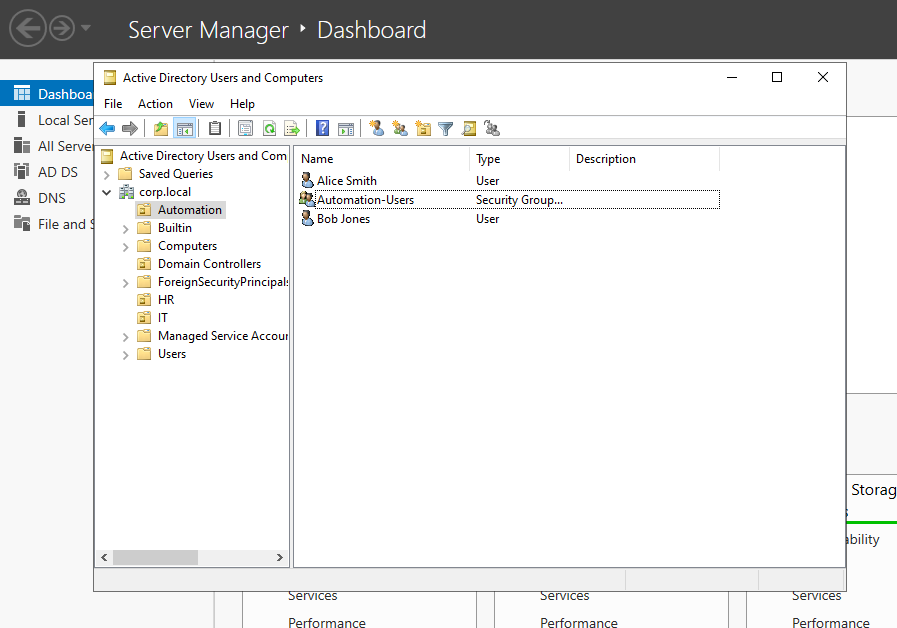
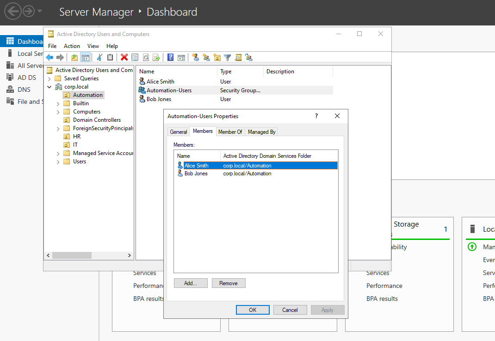

# PowerShell Automated AD User Creation

This lab automates Active Directory user and group management using PowerShell, processing data from a CSV file to create or update users in a dedicated "Automation" OU. It ensures idempotency, assigns group memberships, enforces password changes, and logs actions without affecting existing domain structures.

## Lab Environment
- Domain: corp.local
- Existing OUs: IT, HR
- Existing Groups: IT-Admins (in IT OU), HR-Staff (in HR OU)
- Existing Users: jsmith (John Smith in IT), mjones (Mary Jones in HR)
- Target OU: Automation (created if absent)

## CSV File Structure
The CSV defines users for processing:

| Column   | Description                          |
|----------|--------------------------------------|
| Username | sAMAccountName for the user         |
| FirstName| User's first name                   |
| LastName | User's last name                    |
| Password | Initial password (enforces change)  |
| Groups   | Comma-separated groups in Automation OU |

Example (`NewUsers.csv`):
```
Username,FirstName,LastName,Password,Groups
asmith,Alice,Smith,Password123!,Automation-Users
bjones,Bob,Jones,Password123!,Automation-Users
```

## Script Overview
`Create-ADUsers.ps1` executes these operations:

- **Logging**: Generates timestamped log file for actions and errors.
- **Prerequisites**: Validates AD module, CSV existence, and log directory.
- **OU Management**: Verifies or creates "Automation" OU under domain root.
- **User Processing**: For each CSV entry:
  - Checks user existence.
  - Updates attributes if present; creates with password otherwise.
  - Sets `UserMustChangePasswordAtNextLogon` to true.
  - Logs outcomes.
- **Group Management**: Verifies or creates groups in Automation OU; adds users idempotently.

## How to Run
Place `Create-ADUsers.ps1` and `NewUsers.csv` in a directory on the Windows Server.

Launch PowerShell as Administrator:
```
cd "C:\Path\To\Script"
.\Create-ADUsers.ps1
```

## Verification
List users in Automation OU:
```
Get-ADUser -Filter * -SearchBase "OU=Automation,DC=corp,DC=local" | Select-Object SamAccountName, GivenName, Surname
```

View group memberships (e.g., for asmith):
```
Get-ADPrincipalGroupMembership -Identity "asmith" | Select-Object Name
```

Confirm password change flag:
```
(Get-ADUser -Identity "asmith" -Properties PwdLastSet).PwdLastSet -eq 0
```




## Notes
- Idempotent design prevents duplicates on re-runs.
- Operations isolated to Automation OU.
- Logs enable auditing; review for errors.

## Summary
- Automation OU created or verified.
- Users (e.g., asmith, bjones) added/updated with groups (e.g., Automation-Users).
- Passwords set with enforced changes.
- Verification confirms structure and memberships intact.

This automation streamlines AD user provisioning while maintaining isolation.
