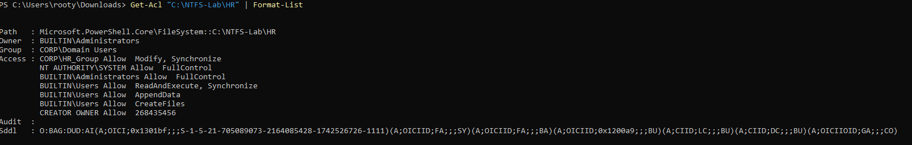
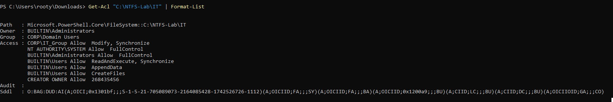
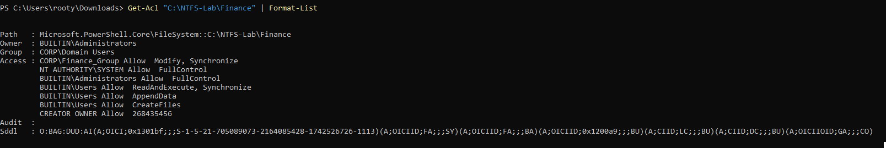
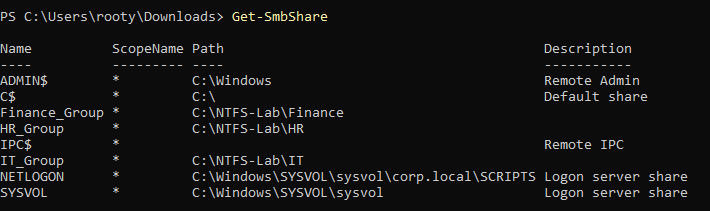
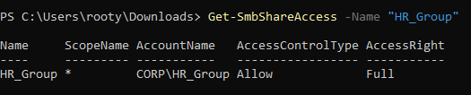
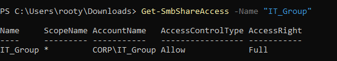
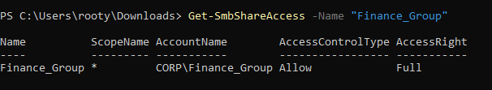

# NTFS Permissions and Shared Folders Configuration

This lab establishes secure folder access on Windows Server using Active Directory groups for departmental isolation. It creates groups in OUs, sets NTFS Modify permissions, configures SMB shares with Full Access per group, and verifies configurations to enforce read/write/delete rights within designated folders only.

## 1. Create Active Directory Groups
Define global groups in respective OUs for user assignment:

HR Group:
```
New-ADGroup -Name "HR_Group" -SamAccountName "HR_Group" -GroupScope Global -Path "OU=HR,DC=corp,DC=local"
```

IT Group:
```
New-ADGroup -Name "IT_Group" -SamAccountName "IT_Group" -GroupScope Global -Path "OU=IT,DC=corp,DC=local"
```

Finance Group:
```
New-ADGroup -Name "Finance_Group" -SamAccountName "Finance_Group" -GroupScope Global -Path "OU=HR,DC=corp,DC=local"
```
Global scope enables domain-wide user inclusion; OU placement maintains organization.

## 2. Create Folders
Establish department directories:
```
New-Item -Path "C:\NTFS-Lab\HR" -ItemType Directory -Force
New-Item -Path "C:\NTFS-Lab\IT" -ItemType Directory -Force
New-Item -Path "C:\NTFS-Lab\Finance" -ItemType Directory -Force
```
`-Force` overwrites if existing.

## 3. Assign NTFS Permissions
Grant Modify access (read/write/delete) to each group's folder, inheriting to subitems:

HR Folder:
```
$folder = "C:\NTFS-Lab\HR"
$acl = Get-Acl $folder
$rule = New-Object System.Security.AccessControl.FileSystemAccessRule("HR_Group", "Modify", "ContainerInherit,ObjectInherit", "None", "Allow")
$acl.SetAccessRule($rule)
Set-Acl -Path $folder -AclObject $acl
```

IT Folder:
```
$folder = "C:\NTFS-Lab\IT"
$acl = Get-Acl $folder
$rule = New-Object System.Security.AccessControl.FileSystemAccessRule("IT_Group", "Modify", "ContainerInherit,ObjectInherit", "None", "Allow")
$acl.SetAccessRule($rule)
Set-Acl -Path $folder -AclObject $acl
```

Finance Folder:
```
$folder = "C:\NTFS-Lab\Finance"
$acl = Get-Acl $folder
$rule = New-Object System.Security.AccessControl.FileSystemAccessRule("Finance_Group", "Modify", "ContainerInherit,ObjectInherit", "None", "Allow")
$acl.SetAccessRule($rule)
Set-Acl -Path $folder -AclObject $acl
```
Inheritance applies to files/subfolders; SYSTEM/Administrators retain full control; others denied.

## 4. Share Folders
Create SMB shares with group-specific Full Access:
```
New-SmbShare -Name "HR_Group" -Path "C:\NTFS-Lab\HR" -FullAccess "HR_Group"
New-SmbShare -Name "IT_Group" -Path "C:\NTFS-Lab\IT" -FullAccess "IT_Group"
New-SmbShare -Name "Finance_Group" -Path "C:\NTFS-Lab\Finance" -FullAccess "Finance_Group"
```
Restricts network access to group members.

## 5. Verify Access Control
Inspect NTFS and share configurations:

NTFS Verification:
```
Get-Acl "C:\NTFS-Lab\HR" | Format-List
Get-Acl "C:\NTFS-Lab\IT" | Format-List
Get-Acl "C:\NTFS-Lab\Finance" | Format-List
```
Expected: Modify for respective groups; full for SYSTEM/Administrators; no extraneous access.

Share Verification:
```
Get-SmbShare
Get-SmbShareAccess -Name "HR_Group"
Get-SmbShareAccess -Name "IT_Group"
Get-SmbShareAccess -Name "Finance_Group"
```
Expected: Shares listed; Full Access per group only.









## Summary
- Groups (HR_Group, IT_Group, Finance_Group) created in OUs.
- Folders established with NTFS Modify permissions inherited per group.
- SMB shares configured for network access limited to group members.
- Verifications confirm isolation and required rights.

This setup demonstrates granular access control for departmental data security.
