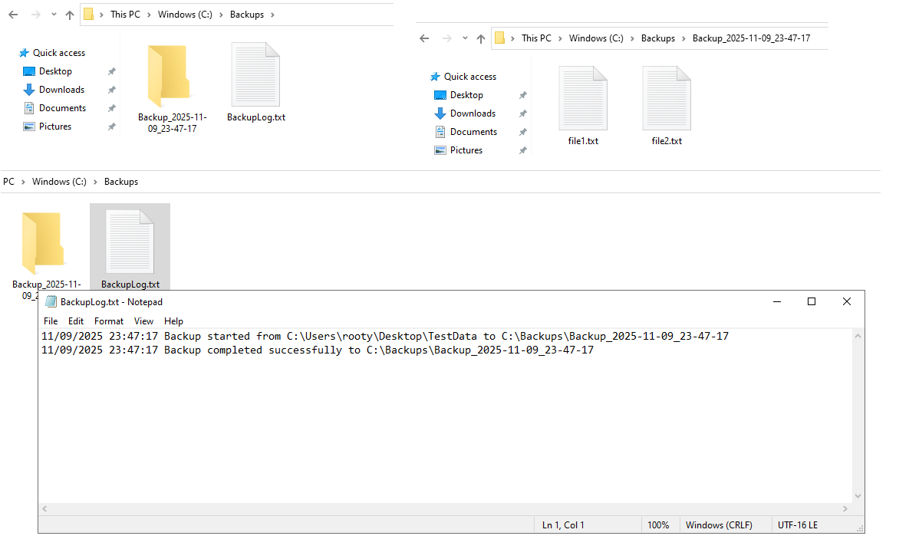
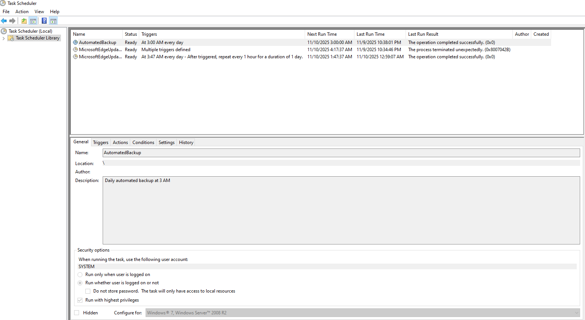
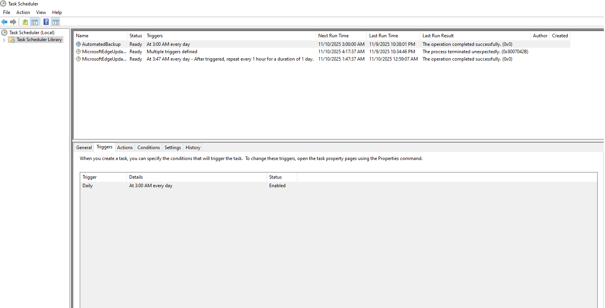
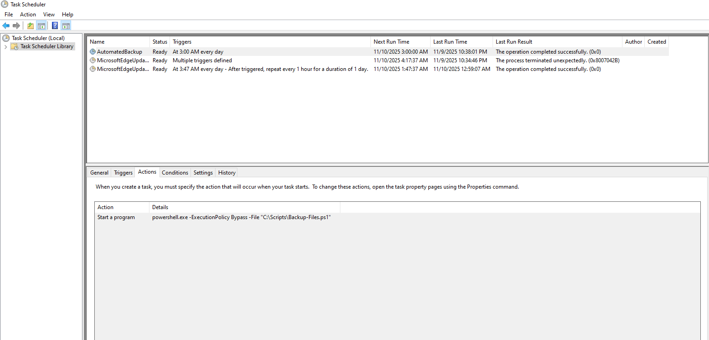

# Automated Backup and Snapshot Lab

This lab implements a PowerShell-based automated backup system for file directories on Windows Server, integrated with Task Scheduler for daily execution. It includes timestamped folder creation, recursive copying with error handling, and comprehensive logging for auditing.

## 1. Script Preparation
Create the script directory and file:
```
New-Item -Path "C:\Scripts" -ItemType Directory -Force
```
Develop `Backup-Files.ps1` in `C:\Scripts\`.

## 2. Script Logic and Full Script
The script defines source (`C:\Users\rooty\Desktop\TestData`) and destination (`C:\Backups`) paths, generates a timestamped subfolder, copies contents recursively (skipping inaccessible items), and logs start/completion/errors to `C:\Backups\BackupLog.txt`.

Full script:
```powershell
# Backup-Files.ps1
# Automated backup script with error handling and logging
# Paths
$SourcePath = "C:\Users\rooty\Desktop\TestData" # Folder to back up
$DestinationRoot = "C:\Backups" # Backup root folder
$DateTime = Get-Date -Format "yyyy-MM-dd_HH-mm-ss"
$DestinationPath = Join-Path $DestinationRoot "Backup_$DateTime"
$LogFile = Join-Path $DestinationRoot "BackupLog.txt"
# Ensure backup root exists
if (!(Test-Path -Path $DestinationRoot)) {
    New-Item -Path $DestinationRoot -ItemType Directory | Out-Null
}
# Create timestamped backup folder
New-Item -Path $DestinationPath -ItemType Directory | Out-Null
# Start log
"$((Get-Date).ToString('MM/dd/yyyy HH:mm:ss')) Backup started from $SourcePath to $DestinationPath" | Out-File $LogFile -Append
# Copy files with error handling
Try {
    Get-ChildItem -Path $SourcePath -Recurse -ErrorAction SilentlyContinue | Copy-Item -Destination $DestinationPath -Recurse -Force -ErrorAction Stop
    "$((Get-Date).ToString('MM/dd/yyyy HH:mm:ss')) Backup completed successfully to $DestinationPath" | Out-File $LogFile -Append
}
Catch {
    "$((Get-Date).ToString('MM/dd/yyyy HH:mm:ss')) ERROR: $($_.Exception.Message)" | Out-File $LogFile -Append
}
```

## 3. Testing the Script
Execute manually:
```
powershell.exe -ExecutionPolicy Bypass -File "C:\Scripts\Backup-Files.ps1"
```
Verify:
- Timestamped folder in `C:\Backups` (e.g., `Backup_2025-11-09_22-38-03`).
- Copied files (e.g., `file1.txt`, `file2.txt`).
- Log entries in `C:\Backups\BackupLog.txt`.

## 4. Automation with Task Scheduler
Create task "AutomatedBackup":
- Trigger: Daily at 03:00 AM.
- Action: `powershell.exe -ExecutionPolicy Bypass -File "C:\Scripts\Backup-Files.ps1"`.
- Settings: Highest privileges; run whether logged on or not.

Test via Task Scheduler manual run; confirm folder/log updates.

## 5. Verification Commands
Recent backups:
```
Get-ChildItem "C:\Backups" | Sort-Object LastWriteTime -Descending | Select-Object -First 3
```

Latest backup contents:
```
Get-ChildItem "C:\Backups\<backup_folder_name>"
```

Recent logs:
```
Get-Content "C:\Backups\BackupLog.txt" -Tail 10
```

Task status:
```
Get-ScheduledTask -TaskName "AutomatedBackup" | Get-ScheduledTaskInfo
```

## 6. Idempotency and Error Handling
Multiple runs generate unique timestamped folders, preventing overwrites. Inaccessible items are skipped (`-ErrorAction SilentlyContinue`); errors logged without halting.






## Summary
- PowerShell script developed for recursive backups with logging.
- Manual testing confirmed file copying and log accuracy.
- Task Scheduler configured for daily automation at 03:00 AM.
- Verifications ensure operational integrity and idempotency.

This system provides resilient data protection with minimal intervention.
