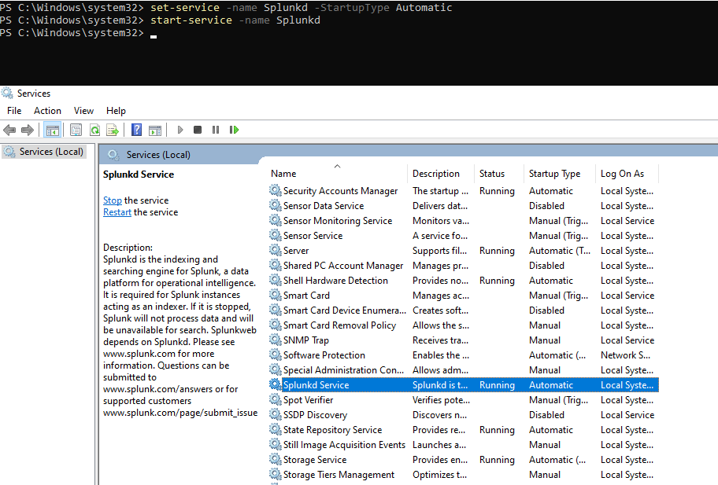
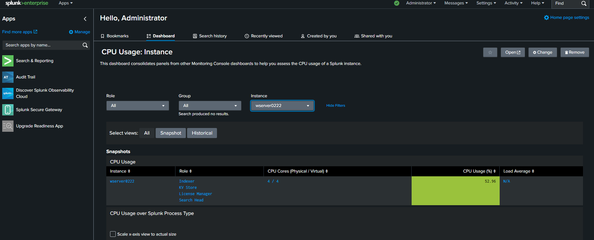

# Splunk Enterprise Installation and Configuration

This lab installs and configures Splunk Enterprise on Windows Server, focusing on log ingestion from system events, index organization, dashboard visualization, search queries, and alert setup for monitoring and SIEM applications.

## Installation and Setup
Download and execute the Splunk Enterprise installer (.msi) on Windows Server. During setup:
- Set admin credentials for Splunk Web access.
- Configure the service to start automatically via Windows Services (splunkd).

Post-installation:
- Access Splunk Web at `http://<server-ip>:8000`.
- Verify service status: Active and running.

## Data Ingestion
Forward Windows system logs (e.g., Application, System, Security) to Splunk:
- In Splunk Web: Settings > Add Data > Monitor > Local Windows Event Log.
- Select logs and forward to the default index (`main`) or create custom indexes (e.g., `windows_logs` via Settings > Indexes > New Index).

This structures data for efficient querying and analysis.

## Dashboard
Create a dashboard for system health monitoring:
- In Splunk Web: Search & Reporting > Build Dashboard.
- Add panels:
  - CPU usage: Search `index=main source="WinEventLog:System" EventCode=1074 | stats avg(PercentProcessorTime) by host`.
  - Recent events: `index=main source="WinEventLog:*" | head 10 | table _time, host, EventCode, Message`.
- Save as "System Overview" for real-time visualization.

## Searches and Alerts
Execute sample searches:
- High CPU events: `index=windows_logs sourcetype=WinHostMon PercentProcessorTime > 80 | table _time, host, PercentProcessorTime`.
- Security logins: `index=main source="WinEventLog:Security" EventCode=4624 | stats count by host, User`.

Configure alerts:
- In Searches: Save search > Add Alert > Trigger on condition (e.g., CPU > 90% in last 5 min) > Send email notification.
- Test: Simulate load and confirm alert fires.

## Screenshots

## Summary
- Splunk Enterprise deployed with auto-start service and web access.
- Windows logs ingested into custom indexes.
- Dashboard built for metrics visualization.
- Searches and alerts enabled for event detection.

This foundation supports advanced SIEM workflows and log analytics.
