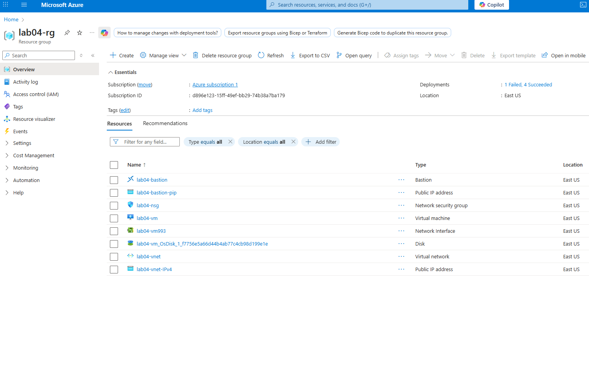
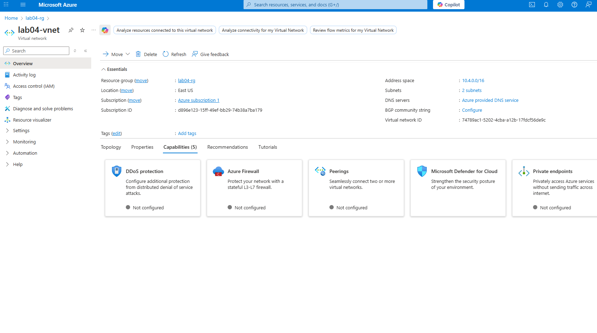
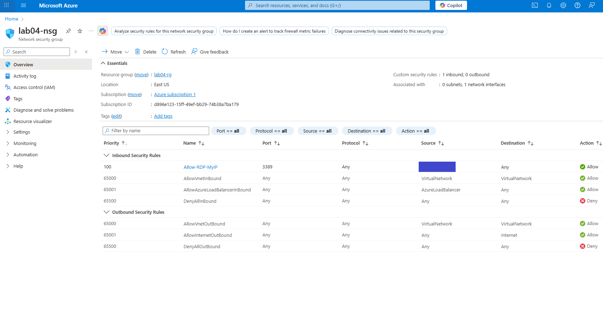
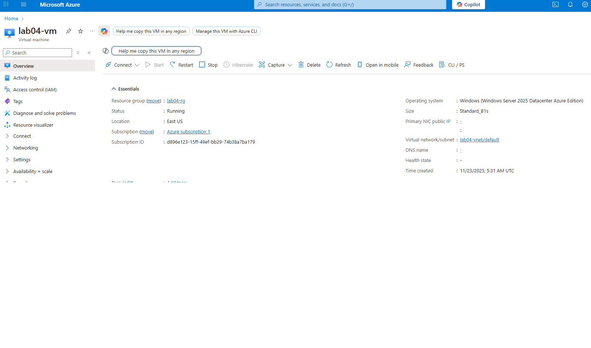
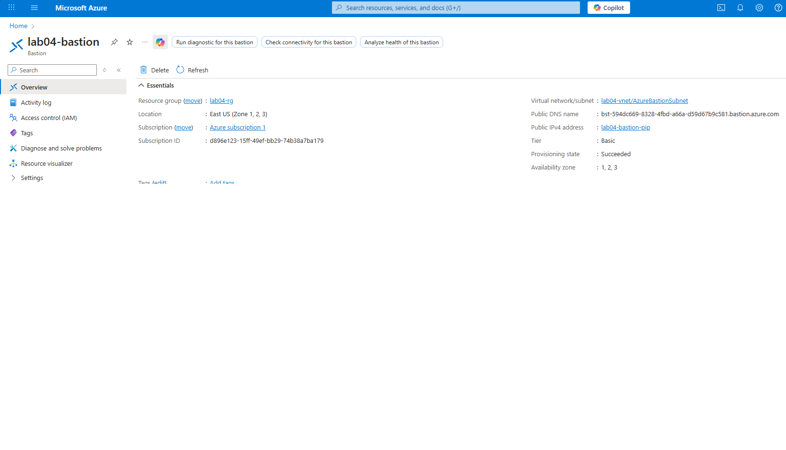
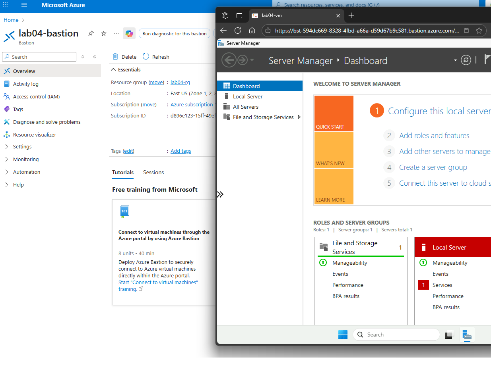

# Azure Cloud Infrastructure  
**Built 100 % via Azure Portal + Bastion – the real-world professional way**  
*November 23, 2025

zero public IP on the VM, Bastion for browser-based RDP, everything free-tier eligible.

## What I built
| Resource               | Name                | Details                                            |
|-----------------------|---------------------|----------------------------------------------------|
| Resource Group        | `lab04-rg`          | East US                                            |
| Virtual Network       | `lab04-vnet`        | 10.4.0.0/16                                        |
| Subnet                | `default`           | 10.4.0.0/24                                        |
| NSG                   | `lab04-nsg`         | RDP (3389) allowed only from my current public IP |
| VM                    | `lab04-vm`          | Windows Server 2022 Datacenter – Standard_B1s (free) |
| Bastion               | `lab04-bastion`     | Secure browser RDP (Basic tier)                    |

## Step-by-step (with exact screenshots)

1. **Created the Resource Group**  
   → Portal → Resource groups → + Create → `lab04-rg` in East US  
   

2. **Created the Virtual Network + default subnet**  
   → Virtual networks → + Create → `lab04-vnet` → address space 10.4.0.0/16 → subnet `default` 10.4.0.0/24  
   

3. **Created the Network Security Group and RDP rule**  
   → Network security groups → + Create → `lab04-nsg`  
   → Inbound security rules → + Add → Source = My IP (auto-detected ***********) → Port 3389 → Name `Allow-RDP-MyIP`  
   

4. **Deployed the Windows Server 2022 VM (free tier)**  
   → Virtual machines → + Create → Windows Server 2022 Datacenter  
   - Size: **Standard_B1s** (free eligible)  
   - Username: `azureuser` / Password: `****************`  
   - Public inbound ports: **None**  
   - Networking: `lab04-vnet` → `default` subnet → NSG `lab04-nsg`  
   

5. **Added AzureBastionSubnet and deployed Bastion**  
   → Inside `lab04-vnet` → Subnets → + Subnet → Name exactly **AzureBastionSubnet** → 10.4.255.0/27  
   → Create → Bastion → `lab04-bastion` (Basic tier)  
   

6. **Connected successfully via Bastion**  
   → VM → Connect → Bastion → azureuser / `****************`  
   → Windows Server 2022 desktop in the browser!  
   

## Why this is the professional way
- No public IP on the VM → zero attack surface  
- Bastion = enterprise standard for secure admin access  
- “My IP” rule automatically updates if my ISP IP changes  
- Everything done via the portal – exactly how 99 % of real deployments happen

**Lab completed, fully functional, secure, and 100 % free-tier compliant.**
