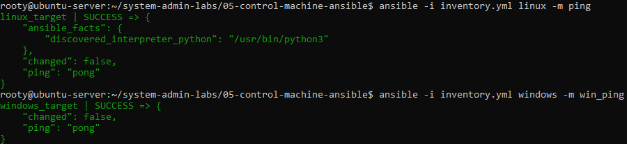
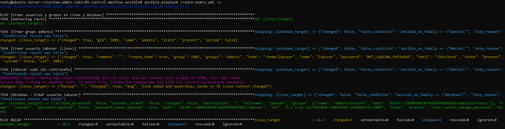
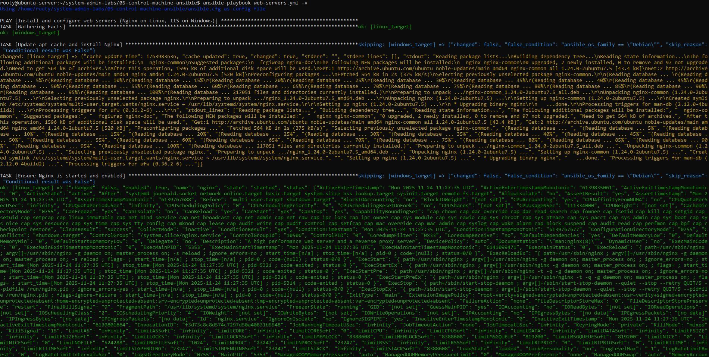
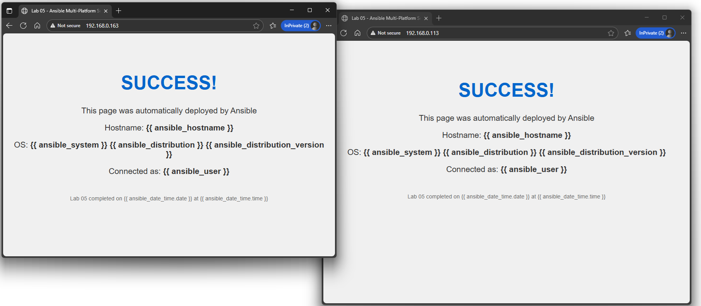

# Ansible Multi-Platform Automation (Linux + Windows)

Fully idempotent Ansible control of heterogeneous environments:
- 1 × Ubuntu 24.04 target → Nginx
- 1 × Windows Server 2022 target → IIS

All secrets protected with encrypted Ansible Vault.

## Lab Objectives Achieved
- Secure connectivity (SSH + WinRM NTLM)
- User & group management with elevated privileges
- Web server deployment (Nginx + IIS)
- Identical dynamic HTML page served from both OS
- Firewall configuration (UFW + Windows Firewall)
- Basic OS hardening
- 100 % idempotent playbooks
- Professional documentation with real execution proof

## Execution Order & Proof

### 1. Connectivity Test – ping/pong success on both platforms
```
ansible -i inventory.yml linux -m ping
ansible -i inventory.yml windows -m win_ping
```



### 2. User & Group Creation
Creates `labuser` with admin rights and passwordless sudo (Linux) / local admin (Windows)
```bash
ansible-playbook create-users.yml --ask-vault-pass
```


### 3. Web Servers Installation & Configuration
- Ubuntu → Nginx (latest)
- Windows → IIS with management tools
```bash
ansible-playbook web-servers.yml --ask-vault-pass
```


### 4. Deploy Identical Test Page (English version with Ansible facts)
```bash
ansible-playbook deploy-html.yml --ask-vault-pass
```
Verification:  
http://192.168.0.163 → Ubuntu + Nginx  
http://192.168.0.113 → Windows Server 2022 + IIS



### 5. Firewall + Basic Hardening (final step)
```bash
ansible-playbook firewall-hardening.yml --ask-vault-pass
```
→ Only ports 22, 80, 443, 5986 allowed

→ Root SSH login disabled

## Security Best Practices Applied
- All credentials stored in encrypted Ansible Vault
- Vault password required on every execution
- No secrets in plain text anywhere
- `.gitignore` protection

## Project Structure (clean & professional)
```
05-control-machine-ansible/
├── ansible.cfg
├── README.md
├── files/index.html
├── group_vars/all/vault.yml    ← ENCRYPTED
├── screenshots/
├── create-users.yml
├── web-servers.yml
├── deploy-html.yml
└── firewall-hardening.yml
```

## Final Result
100 % functional multi-platform automation  
100 % idempotent  
100 % secure  
100 % documented with real execution screenshots


